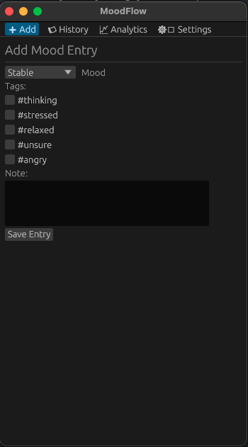

# MoodFlow 😎

Welcome to **MoodFlow** — because apparently, the world needed **yet another mood tracker**. Yes, I know, you’ve probably already got 47 of these apps on your phone, but hey, this one is written in **Rust**, so it’s basically *1000% faster* and makes you feel productive just by opening it.

---

## Features (or Things That Exist)

- Track your moods, because clearly, you can't remember if you were happy yesterday without a digital reminder.
- Add tags like `#stressed`, `#thinking`, `#relaxed`, `#sex`… basically everything your therapist should already know.
- Private and safe, because your deepest existential dread deserves no data leaks.
- No ads, no subscriptions, no annoying push notifications — we’re not monsters.
- Built in Rust, because Python is too mainstream and we like to live dangerously.

---

## Screenshots

*(Pretend these are beautiful and functional; imagination required)*



---

## Installation

Clone it, compile it, and pray that Rust doesn’t yell at you:

```bash
git clone https://github.com/yourusername/moodflow.git
cd moodflow
cargo run
```

## Usage
1. Open the app.
2. Pick your mood (yes, even “Motivated” counts).
3. Add tags, notes, or existential commentary.
4. Hit save. Congratulations, you just tracked your life.

## Settings
- General — because everyone likes a boring tab.
- Moods — customize, delete, or invent new ones.
- Tags — everything from #happy to #hungover.
- Goals — optional, because goal-setting is basically guilt in disguise.

## Contributing
Feel free to fork, clone, PR, or just stare at the code in awe. Rust makes everything look serious, so don’t break the vibe.

## License
MIT. So, yeah, legally you can do whatever you want, but be nice.
